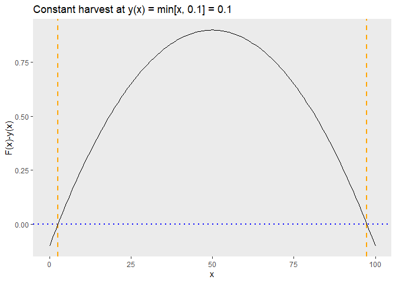
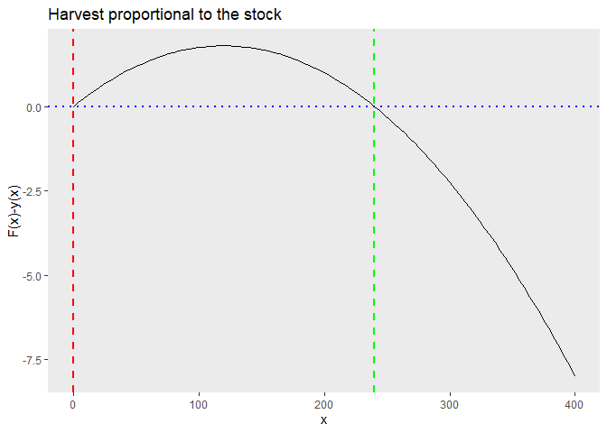
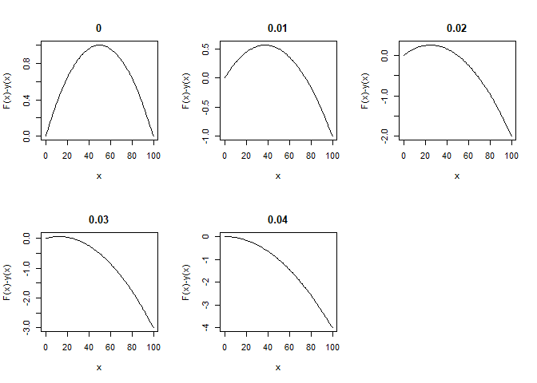
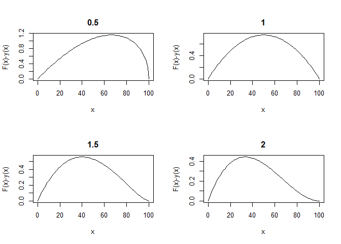

Economics of Renewable Resources
================
Cliff

16/03/2022

-   [Steady States](#steady-states)
    -   [1. For the logistic growth function, $F(x) = 0.04x(1-x/100)$
        and harvest rule
        $y(x) = min[x, 0.1]$](#1-for-the-logistic-growth-function-fx--004x1-x100-and-harvest-rule-yx--minx-01)
    -   [2. For the logistic growth function,$F(x) = 0.05x(1 - x/400)$
        and harvest rule
        $y(x) = 0.02x$](#2-for-the-logistic-growth-functionfx--005x1---x400-and-harvest-rule-yx--002x)
    -   [3. For the logistic growth function,
        $F(x) = 0.04x(1 - x/100)$](#3-for-the-logistic-growth-function-fx--004x1---x100)
-   [Growth Functions](#growth-functions)
    -   [4. Consider the ‘skewed’ logistic growth
        function,$F(x) = \gamma *x(1-x/K)^{\phi}, \phi>0;$](#4-consider-the-skewed-logistic-growth-functionfx--gamma-x1-xkphi-phi0)

Load necessary packages

``` r
rm(list = ls())

## First specify the packages of interest
packages = c("rootSolve","ggplot2","kableExtra")

## Now load or install&load all
package.check <- lapply(
  packages,
  FUN = function(x) {
    if (!require(x, character.only = TRUE)) {
      install.packages(x, dependencies = TRUE)
      library(x, character.only = TRUE)
    }
  }
)
```

## Steady States

### 1. For the logistic growth function, $F(x) = 0.04x(1-x/100)$ and harvest rule $y(x) = min[x, 0.1]$

#### a) Find the steady state stock and harvest levels.

**(i) Considering harvest, y(x) = min\[x, 0.1\] = x **

``` r
f1 <- function(x) {0.04*x*(1-(x/100)) - x}
print(paste("For harvest,y(x) = min[x, 0.1] = x, the steady state stock is: ",uniroot(f1, lower = 0, upper = 100)[1]))
```

    ## [1] "For harvest,y(x) = min[x, 0.1] = x, the steady state stock is:  0"

Considering stock is positive, otherwise the equation gave -2400 as an
alternative value for x

**(ii) Considering harvest, y(x) = min\[x, 0.1\] = 0.1 **

``` r
f1 <- function(x) {0.04*x*(1-(x/100)) - 0.1}
print(paste("For y(x) = min[x, 0.1] = 0.1, the steady state stock is: ",uniroot.all(f1, lower = 0, upper = 100)[1], "& ",uniroot.all(f1, lower = 0, upper = 100)[2]))
```

    ## [1] "For y(x) = min[x, 0.1] = 0.1, the steady state stock is:  2.56583495658461 &  97.4341650434154"

``` r
print(ggplot(data.frame(x=c(0, 100)), aes(x=x)) +
        labs(x = "x", y = "F(x)-y(x)", title = "Constant harvest at y(x) = min[x, 0.1] = 0.1") +
        theme(panel.grid = element_blank()) +
        geom_hline(yintercept = 0, color = "blue", linetype = "dotted", size=1)+
        geom_vline(xintercept = 2.56, color = "orange", linetype = "dashed", size=1)+
        geom_vline(xintercept = 97.43, color = "orange", linetype = "dashed", size=1)+
        stat_function(fun=f1))
```

    ## Warning: Using `size` aesthetic for lines was deprecated in ggplot2 3.4.0.
    ## ℹ Please use `linewidth` instead.

<!-- -->

#### b) Determine if these steady states are stable.

**$x_1$ is a stable steady state if and only if **

$\frac{d(F(x_\infty)-y(x_\infty))}{dx} < 0$

``` r
ex1 = expression(0.04*x*(1-(x/100)) - 0.1)
D1 = D(ex1,'x') #derivate wrt x
for (x in c(2.56, 97.43)) {
  eD1=eval(D1)
print(paste("For x= ",x,"derivate evaluates to ",eD1)) 
}
```

    ## [1] "For x=  2.56 derivate evaluates to  0.037952"
    ## [1] "For x=  97.43 derivate evaluates to  -0.037944"

Considering constant harvest y = x, the curve has one steady state at
x=0. Considering constant harvest, y = 0.1 :

At x = 2.56,
$\frac{d(F(x_\infty)-y(x_\infty))}{dx} = 0.379 > 0 = UNSTABLE$

At x= 97.43,
$\frac{d(F(x_\infty)-y(x_\infty))}{dx} = -.0379 < 0 = STABLE$

### 2. For the logistic growth function,$F(x) = 0.05x(1 - x/400)$ and harvest rule $y(x) = 0.02x$

#### a) Find the steady state stock and harvest levels.

**Proportional Harvest **

``` r
f2 <- function(x) {0.05*x*(1-(x/400)) - 0.02*x}
print(paste("On solving the equation using uniroot we get the steady state stocks as",uniroot.all(f2, lower = 0, upper = 400)[1], "& ",uniroot.all(f2, lower = 0, upper = 400)[2],", and the corresponding harvest levels as",0.02*uniroot.all(f2, lower = 0, upper = 400)[1], "& ",0.02*uniroot.all(f2, lower = 0, upper = 400)[2]) )
```

    ## [1] "On solving the equation using uniroot we get the steady state stocks as 0 &  240 , and the corresponding harvest levels as 0 &  4.8"

``` r
print(ggplot(data.frame(x=c(0, 400)), aes(x=x)) +
        labs(x = "x", y = "F(x)-y(x)", title = "Harvest proportional to the stock") +
        theme(panel.grid = element_blank()) +
        geom_hline(yintercept = 0, color = "blue", linetype = "dotted", size=1)+
        geom_vline(xintercept = 0, color = "red", linetype = "dashed", size=1)+
        geom_vline(xintercept = 240, color = "green", linetype = "dashed", size=1)+
        stat_function(fun=f2))
```

<!-- -->

#### b) Determine if these steady states are stable.

**$x_\infty$ is a stable steady state if and only if **

$\frac{d(F(x_\infty)-y(x_\infty))}{dx} < 0$

``` r
ex2 = expression(0.05*x*(1-(x/400)) - 0.02*x)
D2 = D(ex2,'x') #derivate wrt x
for (x in c(0, 240)) {
  eD2=eval(D2)
print(paste("For x= ",x,"derivate evaluates to ",eD2)) 
}
```

    ## [1] "For x=  0 derivate evaluates to  0.03"
    ## [1] "For x=  240 derivate evaluates to  -0.03"

$$At\hspace{2mm} x=0, \hspace{10mm}\frac{d(F(x_\infty)-y(x_\infty))}{dx} = 0.03 > 0 = UNSTABLE$$

$$And \hspace{2mm} at \hspace{2mm}x= 240,\hspace{10mm} \frac{d(F(x_\infty)-y(x_\infty))}{dx} = -0.3 < 0 = STABLE$$

### 3. For the logistic growth function, $F(x) = 0.04x(1 - x/100)$

#### a) Find the proportional harvest rule (μ values in the function y(x) = μx) that give rise to a steady state equilibrium. \[Hint: solve for the roots of an equation and then substitute back into that equation if there are additional unknowns.\]

**Sol.**

For steady state equating difference of growth and harvest to zero.
$$F(x)-y(x) = 0 $$ $$0.04x(1-x/100) - \mu x =0 $$
$$0.04(1-x/100) - \mu  =0 $$ $$.04(1-x/100) = \mu $$
$$or, x=(0,100) => \mu =(0.04,0) $$

Lets vary $\mu$ from 0 to 0.04 in steps of 0.01 and evaluate x For
convenience using m for $\mu$

``` r
for (m in seq(0,0.04,0.01)) {
  f3 <- function(x) {0.04*x*(1-(x/100)) - m*x}
print(paste("For m = ",m,", the steady state stock is: ",uniroot(f3, lower = 0, upper = 100)[1]))}
```

    ## [1] "For m =  0 , the steady state stock is:  0"
    ## [1] "For m =  0.01 , the steady state stock is:  0"
    ## [1] "For m =  0.02 , the steady state stock is:  0"
    ## [1] "For m =  0.03 , the steady state stock is:  0"
    ## [1] "For m =  0.04 , the steady state stock is:  0"

``` r
par(mfrow = c(2, 3))
for (m in seq(0,0.04,0.01)) {
  f3 <- function(x) {0.04*x*(1-(x/100)) - m*x}
curve(f3, from=0, to=100, , xlab="x", ylab="F(x)-y(x)")
  title(m, line =1)
}
```

<!-- -->

We can see both from the $\mu$ value and from the above plots that the
steady stock levels are at $$x_\infty \in \{0,100\}$$

#### b) Find the steady state stock level(s) and determine if they are stable.

**$x_\infty$ is a stable steady state if and only if **

$\frac{d(F(x_\infty)-y(x_\infty))}{dx} < 0$

``` r
ex3 = expression(0.04*x*(1-(x/100)) - (0.04-0.0004*x)*x)
D3 = D(ex3,'x') #derivate wrt x
for (x in c(0, 100)) {
  eD3=eval(D3)
print(paste("For x= ",x,"derivate evaluates to ",eD3)) 
}
```

    ## [1] "For x=  0 derivate evaluates to  0"
    ## [1] "For x=  100 derivate evaluates to  0"

At x= 0, $\frac{d(F(x_\infty)-y(x_\infty))}{dx} = 0 = STABLE$ At x= 100,
$\frac{d(F(x_\infty)-y(x_\infty))}{dx} = 0 = STABLE$

## Growth Functions

### 4. Consider the ‘skewed’ logistic growth function,$F(x) = \gamma *x(1-x/K)^{\phi}, \phi>0;$

#### a) How does the magnitude of $\phi$ affect the growth rate?

**Sol.** $$F(x) = \gamma *x(1-x/K)^{\phi}$$
$$Growth \hspace{2mm}Rate = F(x)/x = \gamma (1-x/K)^{\phi}$$ The effect
of $\phi$ on growth rate :
$$\frac{dF(x)/x}{d\phi} = \frac{d\gamma (1-x/K)^{\phi}}{d\phi}$$

As $\gamma$ is +ve, $(1-x/K)^{\phi} \ge 0$ as x $\le$ K and $ln(1-x/K)$
is +ve, we have

$$\frac{dF(x)/x}{d\phi}=\gamma ln((1-x/K)(1-x/K)^{\phi} \ge 0$$

#### b) The maximum sustainable yield occurs at x = K/(+1). Derive this formula.

**Given,** $$F(x) = \gamma *x(1-x/K)^{\phi}, \phi>0;$$ **MSY** is the
largest harvest that can be sustained. It occurs at the highest point on
the graph of the growth function which is obtained by solving
$$\frac{dF(x)}{dx} \overset{set}{=} 0 $$ I denote g for $\gamma$ and i
for $\phi$ for the purpose of differentiation in *R*

``` r
f = expression(g*x*(1-(x/K))^i)
D1 = D(f,'x') #derivate wrt x
D1
```

    ## g * (1 - (x/K))^i - g * x * ((1 - (x/K))^(i - 1) * (i * (1/K)))

Setting F.O.C. output, D1 equals to zero:

$$\frac{dF(x)}{dx} \overset{set}{=} 0 $$
$$=> \gamma(1-x/K)^{\phi}-\gamma x(1-x/K)^{\phi-1}*\phi/K \overset{set}{=} 0 $$
$$or, (1-x/K)= x*\phi/K $$ $$or, K=x + x*\phi $$ $$or, K=x(1 + \phi) $$
$$or, x=K/(1 + \phi) $$

#### c) Use a software package of your choice to draw the skewed logistic growth curve for K = 100, $\gamma$ = 0.03, and for both $\phi$ = 2 and $\phi$ = 0.5.

**Vary $\phi$ (denoted as i) from 0.5 to 2 at an interval of 0.5 **

``` r
par(mfrow = c(2, 2))
for (i in seq(0.5,2,0.5)) {
  eq = function(x){0.03*x*(1-(x/100))^i}
  curve(eq, from=0, to=100, , xlab="x", ylab="F(x)-y(x)")
  title(i, line =1)
}
```

<!-- -->
